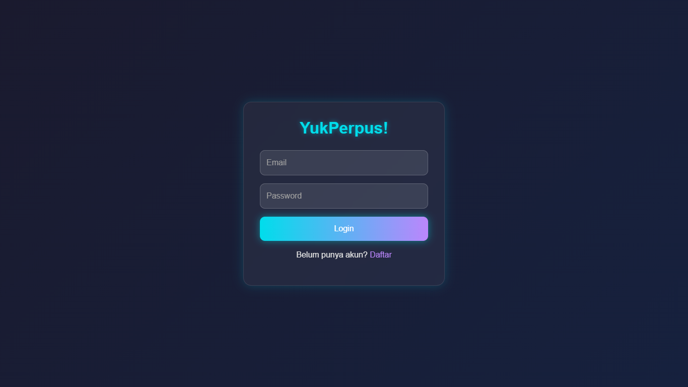
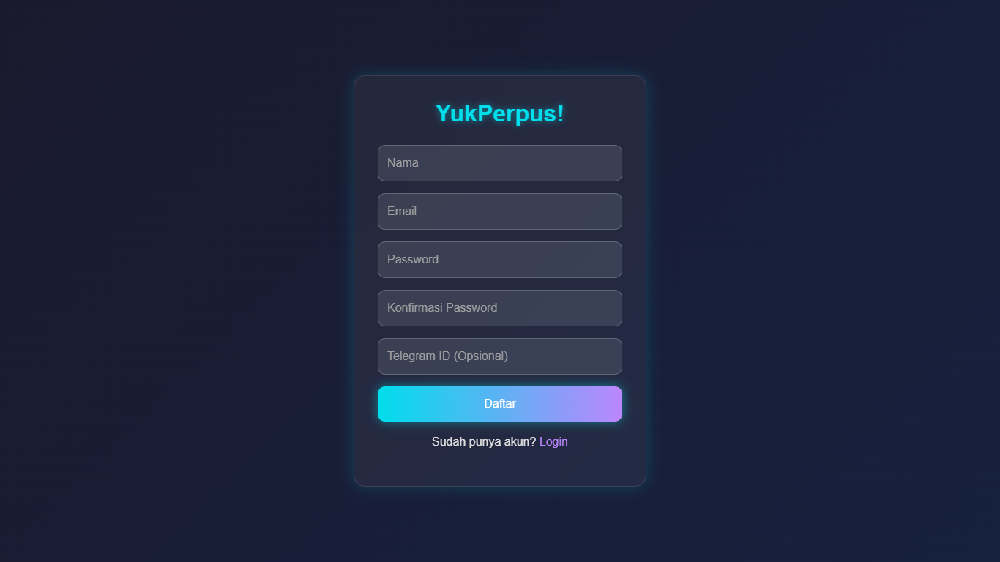
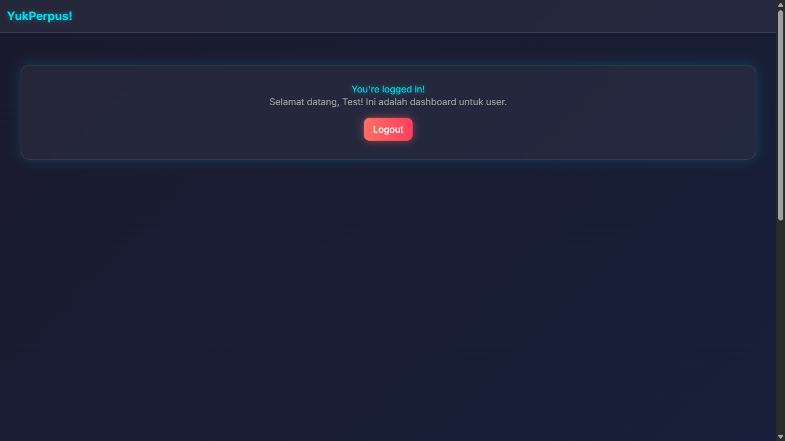

# YukPerpus! 📚


**YukPerpus!** is a simple online library application developed as a university assignment at Pelita Bangsa University, Semester 4. This project is built using Laravel 12 with a modern and futuristic dark-themed UI, inspired by the Monet Engine (Material You) from Android 12+. The application supports authentication for two user roles: **admin** and **user**, each with their own dedicated dashboard.

## ✨ Key Features
- **User Authentication**:
  - Login and registration with a modern UI inspired by 2025 web trends (similar to Facebook).
  - Support for two roles: `admin` and `user`.
- **Role-Based Dashboards**:
  If you want to test login then do this :
  - User dashboard (`user@yukperpus.com`, password: `password123`).
  - Admin dashboard (`admin@yukperpus.com`, password: `password`).
- **Futuristic Design**:
  - Dark theme with glow effects, gradients, and blur.
  - Smooth animations on buttons and inputs.
  - Modern color palette (neon blue, pastel purple) inspired by Monet Engine.
- **Session Management**:
  - Logout functionality via a button on the dashboard and dropdown in the header.
  - Welcome message after successful login.

## 🛠️ Technologies Used
- **Backend**: Laravel 12 (PHP 8.4)
- **Frontend**: Blade, Bootstrap 5.3, Vite
- **Database**: MySQL
- **Styling**: Custom CSS with futuristic effects (glow, blur, gradients)
- **Font**: Inter (Google Fonts)

## 📋 Prerequisites
Before running this project, ensure you have the following installed:
- PHP 8.4 or higher
- Composer
- Node.js and NPM
- MySQL
- Git

## 📸 Screenshots
### Login Page


### Register Page


### Dashboard


## 🚀 Installation Guide
Follow these steps to set up and run the project on your local machine:

1. **Clone the Repository**
   ```bash
   git clone https://github.com/<your-username>/yukperpus.git
   cd yukperpus
   ```

2. **Install PHP Dependencies**
   ```bash
   composer install
   ```

3. **Install Frontend Dependencies**
   ```bash
   npm install
   npm run build
   ```

4. **Configure Environment**
   - Copy the `.env.example` file to `.env`:
     ```bash
     cp .env.example .env
     ```
   - Open the `.env` file and update the database configuration:
     ```env
     DB_CONNECTION=mysql
     DB_HOST=127.0.0.1
     DB_PORT=3306
     DB_DATABASE=yukperpus
     DB_USERNAME=root
     DB_PASSWORD=
     ```
   - Generate the application key:
     ```bash
     php artisan key:generate
     ```

5. **Run Database Migrations**
   - Ensure the `yukperpus` database is created in MySQL.
   - Run the migrations to create the tables:
     ```bash
     php artisan migrate
     ```
   - (Optional) Seed the database to create default users:
     - Open `database/seeders/DatabaseSeeder.php` and add:
       ```php
       public function run()
       {
           \App\Models\User::create([
               'name' => 'Admin',
               'email' => 'admin@yukperpus.com',
               'password' => bcrypt('password'),
               'role' => 'admin',
           ]);
           \App\Models\User::create([
               'name' => 'User',
               'email' => 'user@yukperpus.com',
               'password' => bcrypt('password123'),
               'role' => 'user',
           ]);
       }
       ```
     - Run the seeder:
       ```bash
       php artisan db:seed
       ```

6. **Run the Application**
   ```bash
   php artisan serve
   ```
   - Open `http://127.0.0.1:8000` in your browser.

7. **Login Credentials**
   If you want to test login then do this
   - **Admin**: `admin@yukperpus.com` / `password`
   - **User**: `user@yukperpus.com` / `password123`

## 🗄️ Database Structure
The database includes the following table:
- **users**:
  - `id`: Primary key
  - `name`: User's name
  - `email`: User's email (unique)
  - `password`: Password (hashed)
  - `role`: User's role (`admin` or `user`)
  - `telegram_id`: Telegram ID (optional)
  - `email_verified_at`: Timestamp for email verification
  - `remember_token`: Token for "remember me" functionality
  - `created_at`, `updated_at`: Timestamps

## 🤝 Contributing
We welcome contributions! Here's how you can contribute:
1. Fork this repository.
2. Create a new branch for your feature or bug fix:
   ```bash
   git checkout -b your-feature
   ```
3. Commit your changes:
   ```bash
   git commit -m "Add your feature"
   ```
4. Push to your branch:
   ```bash
   git push origin your-feature
   ```
5. Create a Pull Request on GitHub.

## 📜 License
This project is licensed under the [MIT License](LICENSE). Feel free to use, modify, and distribute as needed.

## 📧 Contact
For questions or suggestions, please reach out:
- Email: gustiadityacreator07@gmail.com
- GitHub: Gustyx-Power
- Telegram: @GustyxPower

---

Thank you using YukPerpus! for Representations , We hope you find it useful! 🚀# YukPerpus! 📚
